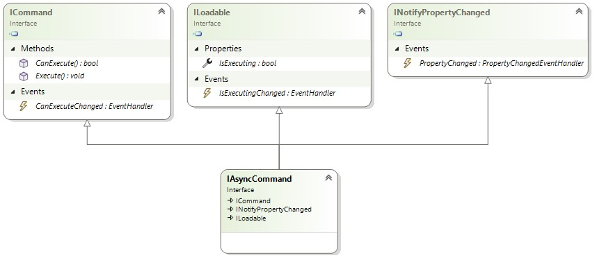

# Commands

## Commands recap

In the [overview](xref:Overview.Mvux.Overview) you've seen a brief introduction on how a method in the Model gets generated as a command in the Bindable Proxy Model.

## Asynchronous commands

The [`AsyncCommand`](https://github.com/unoplatform/uno.extensions/blob/main/src/Uno.Extensions.Reactive/Presentation/Commands/AsyncCommand.cs) class, is a Command that implements [`ICommand`](https://learn.microsoft.com/en-us/windows/windows-app-sdk/api/winrt/microsoft.ui.xaml.input.icommand?view=windows-app-sdk-1.3) and adds support for asynchronous operations.  
As it implements `ICommand`, it can be bound from the View as a regular Command (e.g. in a `Button.Command` property). The advantage is that it can be invoked asynchronously.  
In addition it also implements [`INotifyPropertyChanged`](https://learn.microsoft.com/en-us/dotnet/api/system.componentmodel.inotifypropertychanged), to enable tracking if its properties have changed, and `ILoadable` - an Uno interface that provides information of an objects state whether it's currently in execution mode or not.



## Creating commands

There are several methods of how to create an MVUX command.

1. Using code generation

    ### Basic commands

    When creating a method in the Model, it will be generated as an `AsyncCommand` in the Bindable Model.

    For example, when declaring a method of the following signatures:

    ```csharp
    public void DoWork();
    public ValueTask DoWork();
    public ValueTask DoWork(CancellationToken ct);    
    ```

    A `DoWork` command will be generated in the Bindable Proxy Model. When that command is executed via a button-click etc., the method in the Model will be called:

    ```xml
    <Button Command="{Binding DoWork}" />
    ```

    As you may have noticed, the method can be asynchronous and take a `CancellationToken`, but these are not mandatory and commands will be generated for synchronous methods as well.

    ### Adding command parameters

    An additional parameter can be added to the method, which is then assigned with the value of the `CommandParameter` received from the View. For instance when using a Button and clicking it, the method will be called with the [`Button.CommandParameter`](https://learn.microsoft.com/en-us/windows/windows-app-sdk/api/winrt/microsoft.ui.xaml.controls.primitives.buttonbase.commandparameter) value, given that the type of the value matches the method parameter type. Otherwise the command's `CanExecute` will be false thereby disabling the button:

    ```csharp
    public void DoWork(int param)
    {
        ...
    }
    ```

    ```xml
    <Button Command="{Binding DoWork}" CommandParameter="{Binding MyIntegerValue}" />
    ```    

    Accordingly, if the `CommandParameter` type does not match the parameter type of the method, the button will remain disabled:

    ```xml
    <Button Command="{Binding DoWork}" CommandParameter="A string, not an integer" />
    ```

    Result:

    
        
    ### Command generation rules:
    
     - Any parameter that has a type and name matching a Feed or a State in this Model will be evaluated when the Command is invoked and its current latest value will be passed in as an argument.  
     You'll find this feature to be very powerful in invoking commands by combining data from various Feeds in addition to a command parameter received from the View.    
     - Can be either synchronous or asynchronous
     - Can have one `CancellationToken` as its last parameter, but it's not mandatory.

     ### Using attributes to control command generation

     #### ImplicitCommands attribute

     By default, implicit command generation is enabled by default. So that any method in the Model that matches the command criteria will be generated as a command.  
     However, you may choose to switch this off for a specific method, class, or for the entire assembly.

     This can be achieved using the `ImplicitCommands` attribute. Here are some examples:

     ```csharp
     [assembly:ImplicitCommands(false)]
     
     [ImplicitCommands(true)]
     public partial record MyModel();

     [ImplicitCommands(true)]
     public void MyCommand();
     ```

     These attributes can be used interchangeably to control command generation, for example you may choose to disable implicit feed command parameter altogether by using the attribute with the `assembly:` prefix. You can then opt-in specific classes or methods. You can also switch off a specific classes while opting-in certain methods by decorating them with this attribute as enabled. You can choose any combination to opt in or out implicit command generation.     

     #### FeedParameter attribute

     You can explicitly match a parameter with a Feed even the names don't match by decorating the parameter with the `FeedParameter` attribute:  
     
     ```csharp
     public IFeed<string> Message { get; }
     
     public async ValueTask Share([FeedParameter(nameof(Message))] string msg)
     {
     }
     ```

     #### ImplicitFeedCommandParameter attribute

     You can also opt in or out of implicit matching of Feeds and command parameters by the decorating the current assembly or class with the `ImplicitFeedCommandParameters` attribute:  
     
     ```csharp
     [assembly:ImplicitFeedCommandParameter(false)]
     
     [ImplicitFeedCommandParameter(true)]
     public partial record MyModel
     ```

     Like `ImplicitCommands`, these can also be nested to opt in or out sections specific sections of the app.

1. Using factory methods

    Commands can also built manually using the static class [`Command`](https://github.com/unoplatform/uno.extensions/blob/main/src/Uno.Extensions.Reactive/Presentation/Commands/Command.cs).  
    This class provides factory methods for creating commands.

    - Async

    ```csharp
    public ICommand MyCommand => Command.Async(async(ct) => await PingServer(ct));
    ```

    > [!Note]  
    > You need not worry about the `=>` operator and that the `Command.Async` will be called over and over, this value is cached and will only be called once.  
    The benefit of using `=>` in place of traditional `{ get; } = ...`, is that local methods are accessible (otherwise these would have been required to be intialized in the constructor).

    - `Create` & `Create<T>`;

    To create a command you can use the fluent API of `ICommandBuilder` provided in the `Command.Create` factory methods, which provides the following three methods:

    - Given - This method takes a Feed (or a State!) and configures a command which will be triggered whenever a new value is available to the Feed.

        ```csharp
        public IFeed<int> PageCount => ...

        public IAsyncCommand MyCommand => Command.Create(builder => builder.Given(PageCount));
        ```

    - When - Limits the command execution to a set prerequisite - in other words sets the 'can execute' of the command.

        ```csharp
        public IAsyncCommand MyCommand => Command.Create<int>(builder => builder.When(i => i > 10));
        ```

    - Then - Sets the actual asynchronous callback to be invoked when the Command is executed. This method will be genereric if there's a preceding parameter setting (via Given or When).

        ```csharp
        public IAsyncCommand MyCommand => Command.Create(builder => builder.Then(async ct => await ExecuteMyCommand(ct)));
        ```

    Here's a complete example:

    ```csharp
    public IAsyncCommand MyCommand => 
        Command.Create(builder => 
            builder
            .Given(CurrentPage)
            .When(currentPage => currentPage > 0)
            .Then(async (currentPage, ct) => await NavigateToPage(currentPage, ct)));
    ```

    This is a diagram detailing the methods in the Command factory toolset:

    
